================================================
Knapsack and Travel Salesman Combined Problem IV
================================================

Until now, we have presented the problem, a way to find an optimum solution using Breath First (BF) and a suboptimal solution with a heuristic function. 
In this article we are going to focus on the combinations and permutations of the solutions to this problem.

- Intra-subpath permuation
- Inter-subpath permuation

These two properties of the problem subject to discussion affect dramatically to the time to find the solution. This is because multiple paths can have the same exact cost and the first two algorithms: BF and a Heuristics version have to explore all the permutations of multiple candidate solutions to get to the end of any of them.

Once we know what properties do to all the problems we can start simplifying the search for the optimal solution avoiding the permutations.

Inter-Subpath permutation
-------------------------
First off we are going to define the **subpath**. A subpath, :math:`s`, is a list of picked elmenets between consecutive passes through the Origin. The most important property about a subpath is that it always starts and ends at the Origin with the knapsack emtpy. E.g. a solution from the three element problem presented in the first article, :math:`p`: ``O->C->B->O->A->O``, has two subpahts: :math:`s_1`: ``O->C->B->O`` and :math:`s_2`: ``O->A->O``. 

So, if we consider the particular solution to the The cost of the solution will be:

.. math:: 

        cost(p) = \sum_i cost(s_i) = s_1 + s_2
 
The cost operation is conmutative respect the subpaths present in the path. So, the solution :math:`s_1 \rightarrow s_2`` is equivalent to :math:`s_2 \rightarrow s_1` which leaves the total cost the same.

With this in mind, we can calculate the number of optimal solution to our problem with the inter-path permutations.

.. math::
        
        permutations_{inter} = |S(p)|!

Where :math:`S(p)` denotes the set of subpaths in the path :math:`p`, :math:`| |` the number of elements in the set and ``!`` the factorial.

For complex scenarios that require mutiple passes through the Origin, the total number of equivalent solutions increases with the factorial of that number.

Particularely, this is noticeable for the paths that go to the Origin after each element. There are :math:`N!` cases of the worst possible path.

Inter-Subpath permutation
-------------------------
This other property, is present in each subpath. It affects the ordering in which the elements are travesed in the subpath. That is, that for the previous case with the subpath ``O->C->B->O``: there is the counterpart ``O->B->C->O``. By changing the order to right to left, it has same elements and cost.

So, for any subpath with two or more elements, there are two inter-subpath permutations.

.. math::
        
        permutations_{intra} = 2^Q, Q = |{s \in S(p) | |s|\geq 2}|

Where :math:`Q` is the number of subpaths, s, in the path, p, with two or more elements. Then, the number of solutions with exactly the same cost to any increases exponentially with the number of subpaths with two or more elements.

.. code-block:: python

        # Distance matrix
        [[0.         9.75354174 4.87325056]
         [9.75354174 0.         5.07073511]
         [4.87325056 5.07073511 0.        ]]
        [
        # Weight and position
        A = Ew(E(weight=3),P(x=1.4943,y=1.6344)),
        B = Ew(E(weight=1),P(x=-7.4938,y=-2.1532)),
        C = Ew(E(weight=3),P(x=-3.2830,y=0.6719))]

        
=======  ===================
COST     PATH        
=======  ===================
20.6478  O->B->C->O->A->O   
20.6478  O->C->B->O->A->O   
20.6478  O->A->O->B->C->O   
20.6478  O->A->O->C->B->O   
26.4671  O->A->B->O->C->O   
26.4671  O->B->A->O->C->O   
26.4671  O->C->O->A->B->O   
26.4671  O->C->O->B->A->O   
26.7251  O->A->O->B->O->C->O
26.7251  O->A->O->C->O->B->O
26.7251  O->B->O->A->O->C->O
26.7251  O->B->O->C->O->A->O
26.7251  O->C->O->A->O->B->O
26.7251  O->C->O->B->O->A->O
=======  ===================

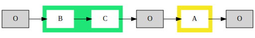
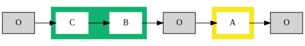
.. image:: images/basic/basic2.svg
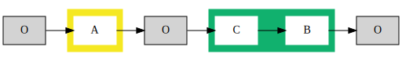
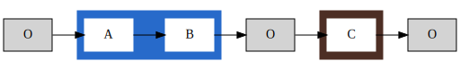
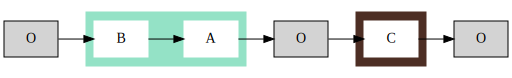
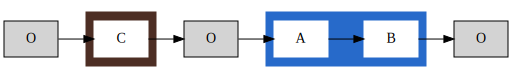
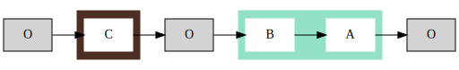
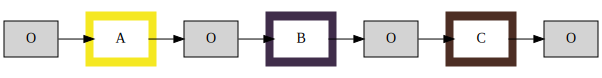
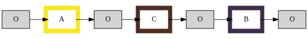
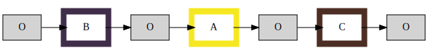
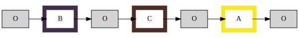
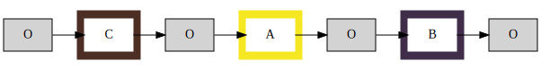
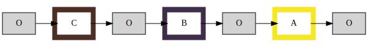

Solutions
=========

S1 - MAXmin - Reducing the candidates
_____________________________________

At any given time, each candidate solution will arrive to the Origin, and from there it will have visited some elements and the rest are in the TODO list.

The knapsack will bound the possible combinations of elements in the TODO list. For instance, the element with higher weight in TODO :math:`max(T)` and the element with least weight in TODO :math:`min(T)` could add up to be greater than the capacity :math:`C`.

If :math:`max(T) + min(T) > C`. The element with greater weight will be required to be visited alone as the knapsack does not have enough capacity to take other element from the TODO list. So, the best solution for the algorithm is to compute the travel and add :math:`max(T)` to the visted list. The minimum and maximum operations can be done fast with the help of structures such as: sorted lists, heaps and binary search trees.

With this simple solution, the Inter-Subpaths are reduced drastically. If this taken each time, in each subpath that has high weight elements without low weight elements will be calculated faster without affecting the optimality of the solution.

S2 - Not repeating the permutations
___________________________________
We will go for the ordered list of combinations without the origin and will analize each list to find the maximum number of elements that can be taken without passing through the Origin.

